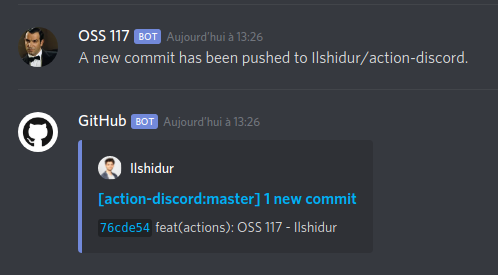

# 🚀 Discord for GitHub Actions

[![Build Status][build-badge]][build-url]

Sends a Discord notification message. Simple as that.
Supports all [workflow event types](https://developer.github.com/webhooks/#events) by using the [Discord GitHub webhooks](https://discordapp.com/developers/docs/resources/webhook#execute-githubcompatible-webhook).

*Appearance on Discord :*



This GitHub action is part of a list of Actions that are located in an other repo. Feel free to check it out : https://github.com/Ilshidur/actions.

## Compatibility note

As this Action is containerized with Docker, [it can only run on Linux environments](https://help.github.com/en/actions/building-actions/about-actions#types-of-actions).

> Docker container actions can only execute in the GitHub-hosted Linux environment.
> Self-hosted runners must use a Linux operating system and have Docker installed to run Docker container actions. For more information about the requirements of self-hosted runners, see "About self-hosted runners."

<hr/>

## Usage

```yaml
- name: Discord notification
  env:
    DISCORD_WEBHOOK: ${{ secrets.DISCORD_WEBHOOK }}
  uses: Ilshidur/action-discord@master
  with:
    args: 'The project {{ EVENT_PAYLOAD.repository.full_name }} has been deployed.'
```

**NOTICE :** for stability purposes, it is recommended to use the action with an explicit commit SHA-1 :

`uses: "Ilshidur/actions-discord@fbd91a9"` (&rarr; link to the commits list : https://github.com/Ilshidur/action-discord/commits/master)

### Arguments

By default, the GitHub action will send a notificaction with the event informations. Providing the arguments will override the message.

**Environment variables** can be interpolated in the message using brackets (`{{` and `}}`) :

e.g.: `Action called : {{ GITHUB_ACTION }}`

**Event Payload** data can also be interpolated in the message using brackets (`{{` and `}}`) with the `EVENT_PAYLOAD` variable.

e.g.: `Action called: {{ GITHUB_ACTION }} as {{ EVENT_PAYLOAD.pull_request.id }}`

> See the [event types](https://developer.github.com/v3/activity/events/types) for valid payload informations.

#### Examples

* `args = "Hello, beautiful ! I ran a GitHub Actions for you <3"`
* `args = "I showed you my commit. Please respond."`

### Environment variables

* **`DISCORD_WEBHOOK`** (**required**): the Discord webhook URL (see https://support.discordapp.com/hc/en-us/articles/228383668-Intro-to-Webhooks).
  * ***IMPORTANT !!* You MUST NOT append `/github` at the end of the webhook.**
* **`DISCORD_USERNAME`** (*optional*): overrides the bot nickname.
* **`DISCORD_AVATAR`** (*optional*): overrides the avatar URL.
* That's all.

## Alternatives

Because open source is about everyone :

https://github.com/marketplace/actions/discord-message-notify <br/>


## TODO

* [Pass arguments with the `with` keyword](https://help.github.com/en/actions/automating-your-workflow-with-github-actions/workflow-syntax-for-github-actions#jobsjob_idstepswith)
* Run outside of a container.

<hr/>

<p align="center">
  Don't forget to 🌟 Star 🌟 the repo if you like this GitHub Action !<br/>
  <a href="https://github.com/Ilshidur/action-discord/issues/new">Your feedback is appreciated</a>
</p>

[build-badge]: https://img.shields.io/endpoint.svg?url=https%3A%2F%2Factions-badge.atrox.dev%2FIlshidur%2Faction-discord%2Fbadge&style=flat
[build-url]: https://actions-badge.atrox.dev/Ilshidur/action-discord/goto
