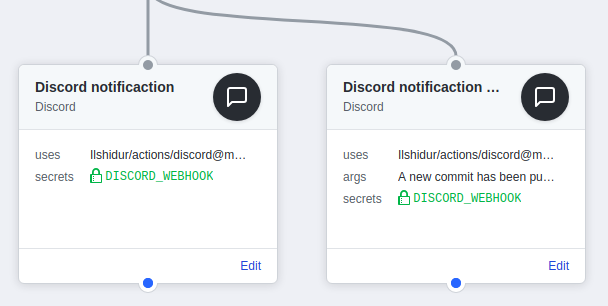

# Discord for GitHub Actions

Sends a Discord notification message. Simple as that.
Supports all [workflow event types](https://developer.github.com/webhooks/#events) by using the [Discord GitHub webhooks](https://discordapp.com/developers/docs/resources/webhook#execute-githubcompatible-webhook).



*Appearance on Discord :*


## Usage

```
action "Discord notification" {
  uses = "Ilshidur/actions/discord@master"
  secrets = ["DISCORD_WEBHOOK"]
  args = "The project has been deployed."
}
```

**NOTICE :** for stability purposes, it is recommended to use the action with an explicit commit SHA-1 :

`uses = "Ilshidur/actions/discord@a08c189"` (=> link to the commits list : https://github.com/Ilshidur/actions/commits/master)

### Arguments

By default, the GitHub action will send a notificaction with the event informations. Providing the arguments will override the message.

#### Examples

* `args = "Hello, beautiful ! I ran a GitHub Actions for you <3"`
* `args = "I showed you my commit. Please respond."`

### Secrets

* **`DISCORD_WEBHOOK`** (**required**): the Discord webhook URL (see https://support.discordapp.com/hc/en-us/articles/228383668-Intro-to-Webhooks)
  * ***IMPORTANT !!* You MUST NOT append `/github` at the end of the webhook.**
* That's all.
